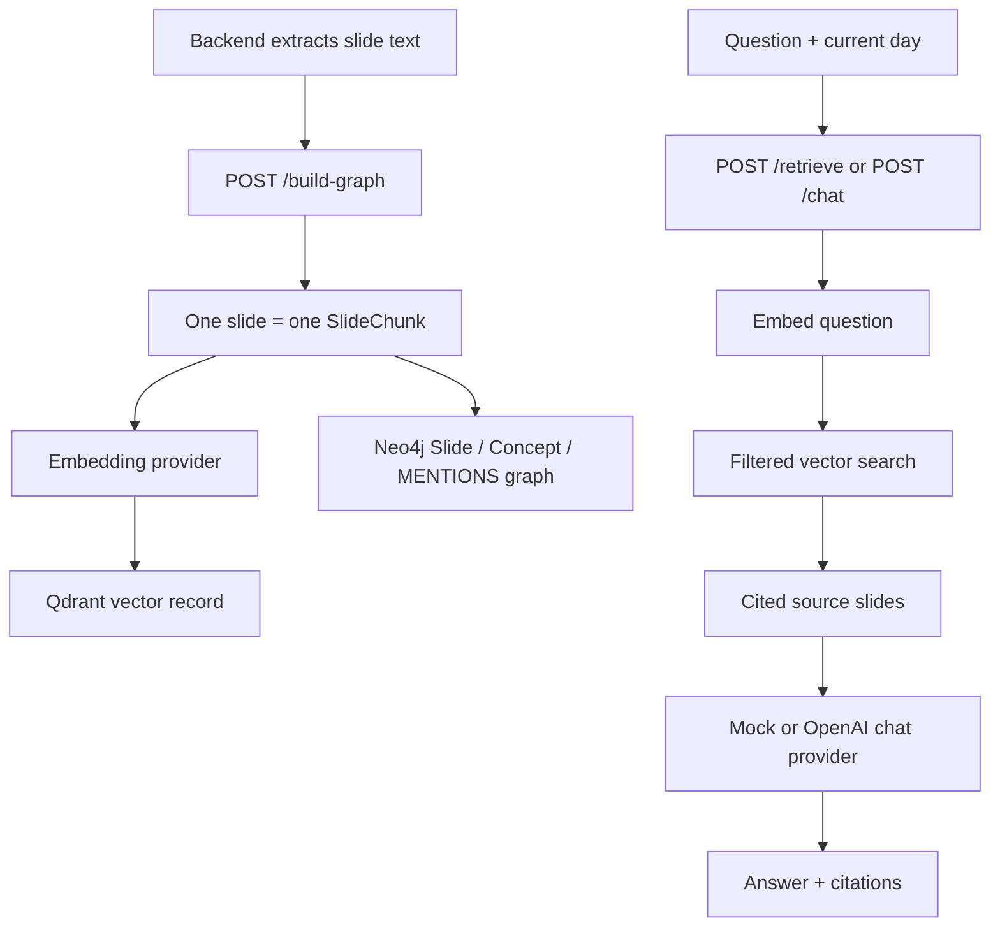

# Slide RAG: Contract and Flow

`agent/` is an independent FastAPI service. It builds context for the AI Tutor from **pre-extracted slide text**. PDF/PPTX extraction, authentication, users, progress, quiz results, and slide upload remain Backend responsibilities.

## Core invariant

Each request slide produces exactly one `SlideChunk` and exactly one vector record. The service never splits a slide, merges slides, or applies overlap.

Each chunk preserves this citation metadata:

```text
chunk_id       = {document_id}:{version}:{slide_number}
document_id    = owning slide deck
day            = learning day, for example "day01"
version        = source deck version
slide_number   = original slide/page number
title, content, concepts
```

`slide_number` must be unique within one `document_id` + `version` payload. Re-indexing the same chunk id updates its vector record; use a new `version` when slide content changes.

## HTTP contract

The process is started by Uvicorn on port `8300`; the application itself does not bind a port.

### `GET /health`

Returns service liveness:

```json
{ "status": "ok" }
```

### `POST /build-graph`

Backend calls this after it has extracted text from a slide deck.

```json
{
  "document_id": "jtbd-day-01",
  "day": "day01",
  "version": "v1",
  "slides": [
    {
      "slide_number": 3,
      "title": "Lực thúc đẩy thay đổi",
      "content": "Push và pull cần thắng được thói quen cùng nỗi lo.",
      "concepts": ["Push", "Pull", "Habit", "Anxiety"]
    }
  ]
}
```

Response:

```json
{
  "indexed_chunks": 1,
  "concepts": ["Anxiety", "Habit", "Pull", "Push"]
}
```

### `POST /retrieve`

Returns ranked source slides. `day` and `document_id` are optional filters; `limit` defaults to 5 and is 1–100.

```json
{
  "question": "Push là gì?",
  "day": "day01",
  "document_id": "jtbd-day-01",
  "limit": 3
}
```

Every item in `sources` contains `document_id`, `day`, `version`, `slide_number`, `title`, `content`, `concepts`, and `score`. Consumers must retain these citations when displaying or auditing an answer.

### `POST /chat`

```json
{
  "user_id": 1,
  "question": "Push là gì?",
  "current_day": "day01",
  "current_slide": 3
}
```

The service retrieves up to five slides scoped to `current_day`, then returns:

```json
{
  "answer": "...",
  "provider": "mock",
  "sources": []
}
```

`provider` is `mock` by default and `openai` only in explicitly configured production mode. `user_id` and `current_slide` are preserved in the contract for the later Backend personalization integration; the current RAG service does not query PostgreSQL.

## Retrieval flow



In local mock mode, deterministic embeddings and in-memory stores replace OpenAI, Qdrant, and Neo4j; the API and one-slide-one-chunk behavior stay the same. In production, Qdrant performs vector retrieval. Neo4j currently persists slide-to-concept relations; traversal/graph expansion is a later Agent node and is not yet added to the returned context.

## Runtime modes

`agent/.env.example` is safe to commit and is the template for collaborators. Copy it to `agent/.env`, then supply local credentials; `agent/.env` is Git-ignored.

| Mode | Required settings | Intended use |
| --- | --- | --- |
| Mock (default) | `RAG_PROVIDER=mock`, `RAG_VECTOR_STORE=memory`, `RAG_GRAPH_STORE=memory` | Offline development and unit tests; no network or key. |
| Live provider | `RAG_PROVIDER=openai`, `RAG_VECTOR_STORE=qdrant`, `RAG_GRAPH_STORE=neo4j`, `OPENAI_API_KEY` | Real embedding, Qdrant retrieval, Neo4j knowledge graph, and OpenAI responses. |

## Local Compose development

`agent/docker-compose.yml` is local development infrastructure only. Qdrant
and Neo4j are pinned to explicit versions and their host ports bind to
`127.0.0.1`; Neo4j requires `NEO4J_AUTH` from the Git-ignored `agent/.env`.
Copy `.env.example` to `.env`, replace the example Neo4j password in both
`NEO4J_PASSWORD` and `NEO4J_AUTH=neo4j/<password>`, then run from `agent/`:

```powershell
docker compose -f docker-compose.yml up -d
python -m pip install -r requirements.txt
uvicorn app.main:app --host 127.0.0.1 --port 8300
```

No live OpenAI request should be attempted until `OPENAI_API_KEY` has been added locally. Unit tests intentionally use mock mode and do not require that key.

## Real deployment

Do not deploy the bundled Compose stack as production infrastructure. A real
deployment needs Qdrant and Neo4j services with authentication, TLS-managed
endpoints, restricted network access, backups, and secrets managed outside the
repository. Configure the Agent with those deployment-specific service URLs and
credentials rather than exposing local database ports.
